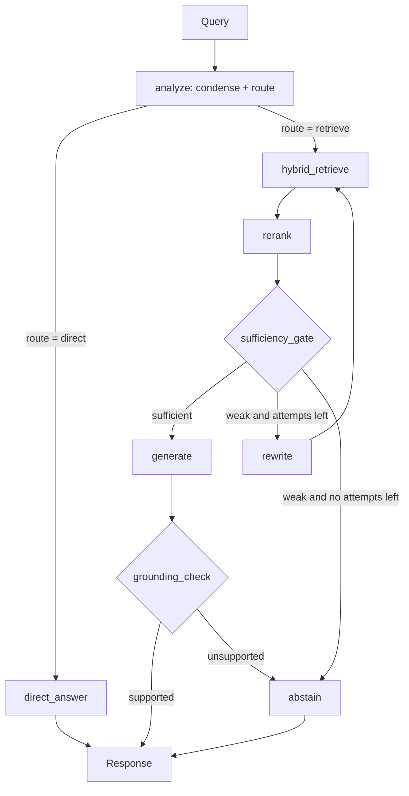

# RAG agent flow: redesign spec

This document describes the target design for the chatbot's LangGraph retrieval flow. It is written for an engineer or coding agent who has the repository open but was not part of the design discussion.

## How to use this spec

1. Read the existing graph first: find where the LangGraph `StateGraph` is built, the state schema, each node function, and the vector store client. Report what you find before changing anything.
2. Where this spec and the existing code disagree on naming or structure, keep the existing conventions and map the spec onto them.
3. Implement in the phases listed at the end, one phase at a time. Run the eval set after each phase and report the numbers before starting the next.
4. If something here cannot be done with the installed versions of LangGraph, Ollama, or the vector database, stop and say so rather than working around it silently.

## Stack (existing, do not replace)

- Orchestration: LangGraph
- Models: served locally through Ollama
  - Embeddings: `embeddinggemma-2`
  - Chat: `gemma4:e4b-mlx`
- Vector database: Milvus or Qdrant (check which one the code actually uses)

The chat model is small and local. Every LLM call is slow relative to everything else in the graph and is less reliable at judgment tasks than a large model. The design therefore prefers non-LLM components for scoring and gating, and keeps LLM calls to a minimum.

## Current flow

```
Query -> Condense -> Retrieve -> Grade -> Generate -> Response
                        ^          |----> Abstain  -> Response
                        |          v
                        +------ Rewrite
```

Problems this redesign fixes:

- Every query goes through retrieval, including greetings and follow-ups about the conversation itself.
- Retrieval is dense-only, so exact terms (codes, names, error strings) are missed.
- Relevance grading is done by the small chat model, which is slow and inconsistent.
- The rewrite loop has no cap and retries the same strategy.
- Nothing verifies the generated answer against the retrieved context.

## Target flow



LLM calls on the happy path: `analyze`, `generate`, `grounding_check`. Everything else on that path is non-LLM.

## Graph state

Extend the existing state rather than replacing it. Fields needed:

| Field | Type | Purpose |
|---|---|---|
| `messages` | list | Conversation history (existing) |
| `question` | str | Standalone question produced by `analyze` |
| `route` | `"retrieve"` or `"direct"` | Routing decision from `analyze` |
| `search_queries` | list[str] | Queries to run; one by default, several after decomposition |
| `candidates` | list of docs | Fused results from hybrid retrieval |
| `context` | list of docs with `rerank_score` | Top documents kept after reranking |
| `attempts` | int | Number of rewrites performed so far |
| `tried_queries` | list[str] | Every query already searched, to prevent repeats |
| `answer` | str | Generated answer |
| `citations` | list | Chunk ids the answer cites |
| `grounded` | bool | Result of the grounding check |
| `outcome` | `"answered"`, `"direct"`, or `"abstained"` | Final path taken, for logging and evals |
| `abstain_reason` | str or None | `"retrieval"` or `"grounding"` |

## Node contracts

### analyze (LLM, one structured call)

Replaces `Condense`. Input: conversation history and the latest user message. Output, as a single structured response: the standalone `question` and the `route`.

- `direct`: greetings, thanks, small talk, and questions answerable from the conversation alone ("summarize what you just said", "make that shorter").
- `retrieve`: everything else. When unsure, choose `retrieve`.

Use the model's structured/JSON output so the result is parsed, not regex-scraped. If parsing fails, default to `route = "retrieve"` with the raw user message as the question.

### direct_answer (LLM)

Answers from conversation history only. Must not state facts about the knowledge base domain; if the user is actually asking a knowledge question, the correct route was `retrieve`.

### hybrid_retrieve (no LLM)

Runs each entry in `search_queries` as both a dense search and a sparse/BM25 search, fuses the results (reciprocal rank fusion unless the database offers a better built-in), deduplicates by chunk id, and writes `candidates`.

- Use the vector database's native hybrid support. This may require adding a sparse field to the collection and reindexing; if so, write the migration as a separate script and flag it, do not run it implicitly.
- Candidate count is configurable (`RETRIEVE_TOP_K`, starting value 30).

### rerank (no LLM)

Scores each candidate against `question` with a cross-encoder reranker, keeps the top `RERANK_KEEP` (starting value 5) in `context` with their scores.

- Choose a small multilingual-capable reranker that runs locally on the same machine. Propose the model and how it will be served before adding the dependency.
- Wrap it behind a small interface so the model can be swapped.

### sufficiency_gate (no LLM, conditional edge)

Replaces `Grade`. Decides from rerank scores alone:

- Sufficient if the top score is at or above `RERANK_THRESHOLD`. Also drop any kept document whose score is below `RERANK_MIN_DOC_SCORE`.
- Otherwise, if `attempts < MAX_REWRITES` (2): go to `rewrite`.
- Otherwise: go to `abstain` with `abstain_reason = "retrieval"`.

Thresholds are not portable between rerankers. Do not hardcode a guess; calibrate them on the eval set (see below) and store them in config.

### rewrite (LLM)

Increments `attempts` and produces new `search_queries`. Each attempt must use a different strategy:

1. First attempt: rephrase with synonyms and expanded abbreviations.
2. Second attempt: decompose into two or three narrower sub-questions, or broaden by removing over-specific terms.

Must not emit a query already in `tried_queries`. If it does, treat the attempt as spent and continue to the gate logic.

### generate (LLM)

Answers `question` using only `context`. Requirements for the prompt:

- Answer only from the provided documents.
- Cite the chunk id for each claim.
- Say so explicitly when the documents only partly answer the question.

### grounding_check (LLM, conditional edge)

Given `answer` and `context`, returns a structured verdict: is every factual claim in the answer supported by the context? Keep the prompt narrow and the output a small JSON object (`supported: bool`, optionally the unsupported claim).

- Supported: finish with `outcome = "answered"`.
- Unsupported: go to `abstain` with `abstain_reason = "grounding"`.

Put this node behind a config flag (`ENABLE_GROUNDING_CHECK`) so it can be turned off if latency is unacceptable.

### abstain (no LLM)

Returns a templated message, not a generated one. It should say that the knowledge base did not contain a reliable answer and, where possible, suggest how to rephrase. Sets `outcome = "abstained"`.

## Constraints

- The loop must be bounded. No path through the graph may call `hybrid_retrieve` more than `MAX_REWRITES + 1` times.
- All tunables (`RETRIEVE_TOP_K`, `RERANK_KEEP`, `RERANK_THRESHOLD`, `RERANK_MIN_DOC_SCORE`, `MAX_REWRITES`, `ENABLE_GROUNDING_CHECK`) live in one config location.
- Log per request: `route`, `attempts`, top rerank score, `outcome`, `abstain_reason`, and per-node latency.
- Keep the public interface of the chatbot (how the graph is invoked and what it returns) unchanged unless a change is called out and agreed.
- Out of scope: ingestion and chunking changes, swapping the chat or embedding model, UI changes.

## Evaluation

Before changing the graph, create an eval set and a script to run it.

- 30 to 50 questions in a simple file (JSONL or CSV): question, expected answer or key facts, and ideally the id of the source document.
- Include questions the knowledge base cannot answer (expected outcome: abstain) and a few conversational turns (expected route: direct).
- If no real questions exist in the repo, generate a draft set from the indexed documents and mark it clearly as needing human review.

The script reports at least: retrieval hit rate (expected source in `context`), answer correctness, abstain precision (abstained when it should have), route accuracy, and median and p95 latency.

## Implementation phases

Run the eval script at the end of every phase and report the change against the previous phase.

| Phase | Work | Done when |
|---|---|---|
| 0 | Eval set and eval script; record baseline on the current graph | Baseline numbers reported |
| 1 | Add `attempts` and `tried_queries` to state; cap the rewrite loop | No request exceeds the cap; tests cover the exhausted path |
| 2 | Add `rerank`; replace `Grade` with `sufficiency_gate`; calibrate thresholds | LLM grader removed; thresholds in config with the eval evidence behind them |
| 3 | Hybrid retrieval, including the collection migration script | Hit rate on exact-term questions improves over phase 2 |
| 4 | Replace `Condense` with `analyze`; add `direct_answer` route | Conversational turns skip retrieval; route accuracy reported |
| 5 | Add `grounding_check` behind its flag | Unsupported answers route to abstain; latency cost reported |

Phases 1 and 2 are expected to deliver most of the benefit. If a phase makes the eval numbers worse, stop and report rather than continuing.
